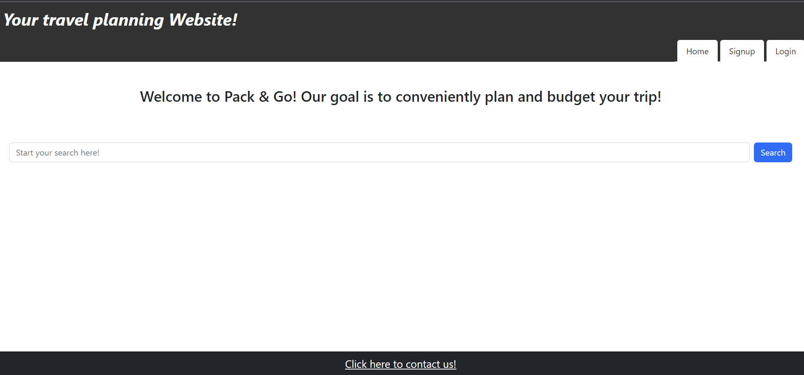
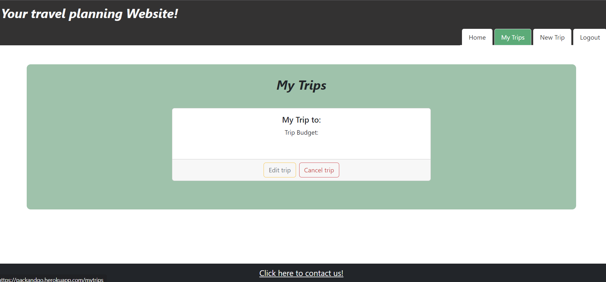

# Pack & Go

## Description

This app allows users to collaborate on creating a travel planner. Users are able to set a desired location for their vacation, set a budget, and even browse for local hotels using a travel API. 

## Links
Deployed site:  
https://packandgo.herokuapp.com/  
Github site:  
https://github.com/julianbenchimol/trip-budget-manager

## Installation
 - Clone repo locally.
 - Go to root level of project.
 - Run `npm run install`.
 - Run `npm run develop`.
 - The application will automatically open. 

## Usage
### Homepage without being logged in: 

### Homepage when user is logged in:

### Sign-up page:

### Login page:

### My trips page:

### New trips page:

  

## Credits

List your collaborators, if any, with links to their GitHub profiles.
- Kevin Bell  
https://github.com/gitkcb
- Julian Benchimol   
https://github.com/julianbenchimol
- Nate Hanisch  
https://github.com/HANIN003
- Alex Frankhouser  
https://github.com/A-Frankhouser
- Cody Kirschbaum  
https://github.com/baumerc10

## Badges

